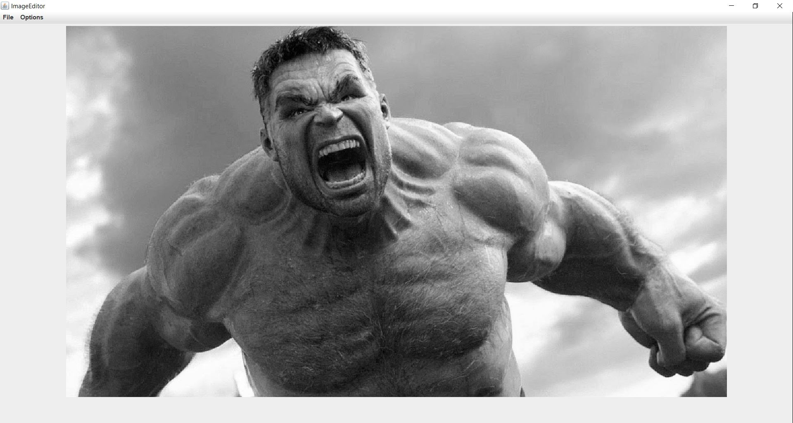
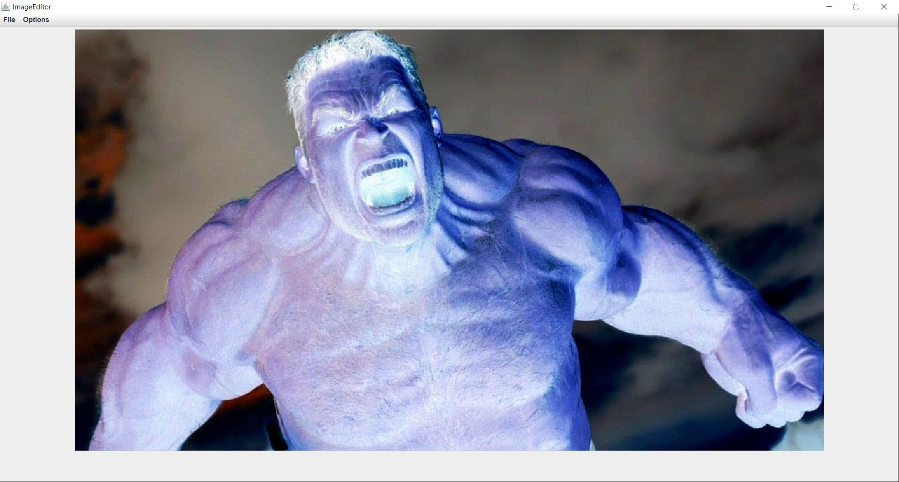
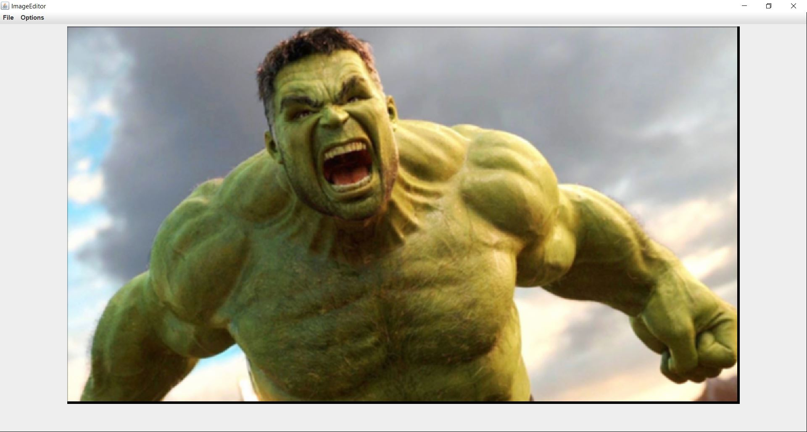
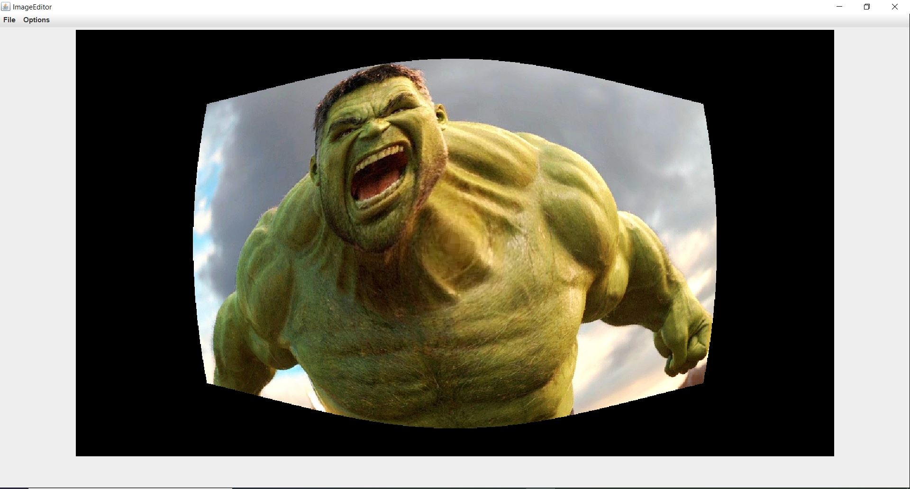
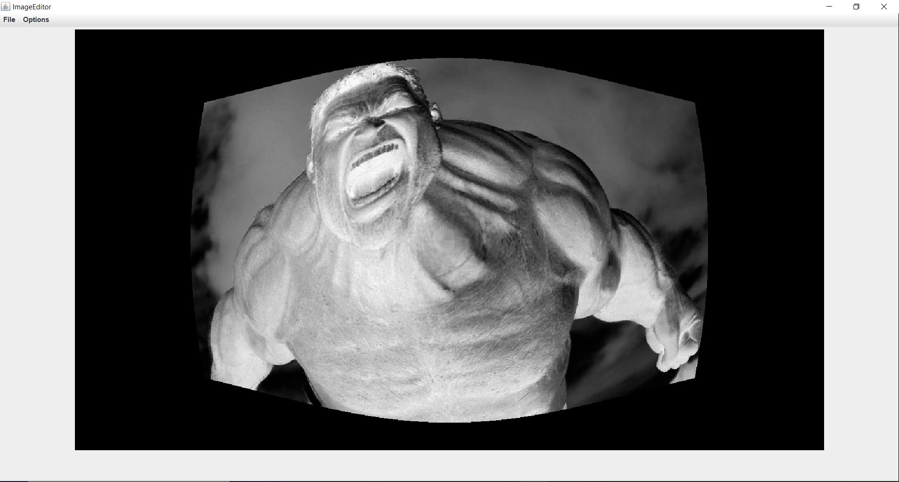
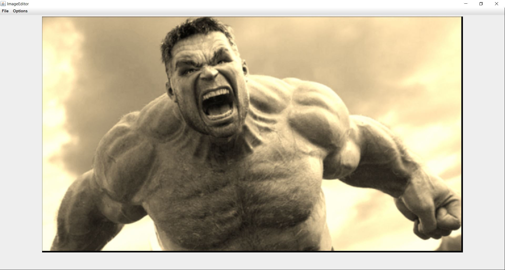

# Image-Editior

Image Editing software developed in Java which allows users to add various effects to their images to spice up their image

# Effects

* Horizontal Flip
* Vertical Flip
* Grey Scale
* Sepia Tone
* Invert Color
* Gaussian Blur
* Buldge Effect

# Requirements 

* Java Runtime Environment (Build 11.0.1+)

# How To Use

* Download the executable jar file 
* Open it once downloaded and have fun customizing your images

# Demo Features

**Original**

**Grey Scale**

**Sepia Tone**

**Invert Color**

**Gaussian Blur**

**Buldge Effect**

**We can also layer as many effects as we like on one another**

**Layer: Invert Color + Grey Scale + Buldge Effect**

**Layer: Sepia Tone + Gaussian Blur**

